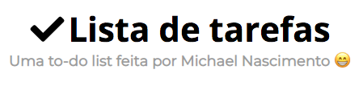
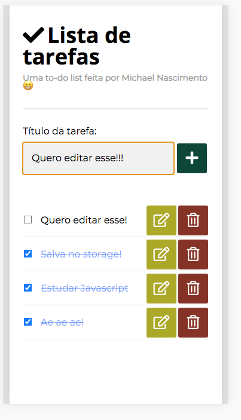
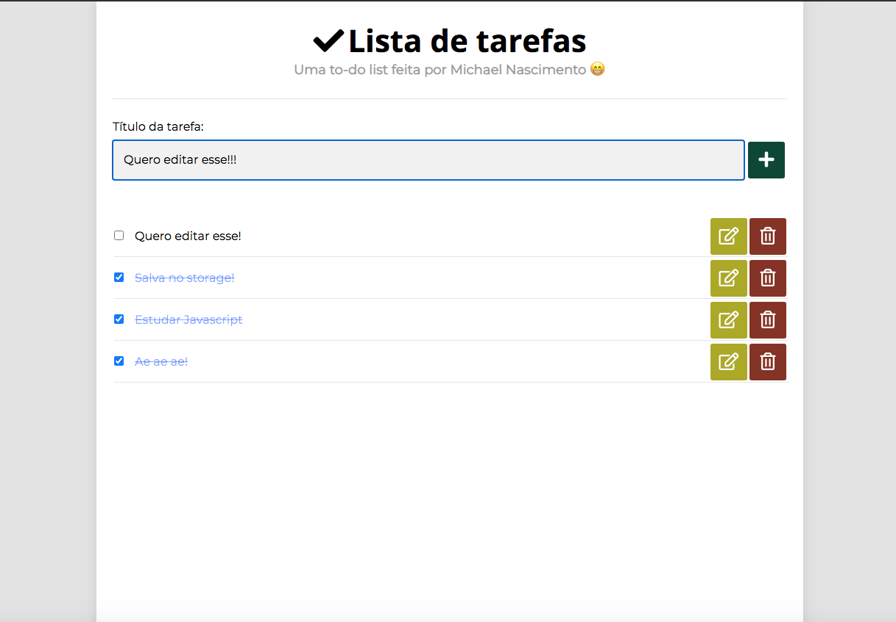

<p align="center">
      
  
  <a href="https://github.com/mikansc/todo-vanilla/commits/main">
    
  </a>
   
</p>
<h1 align="center">
    
</h1>
<p align="center">
Este projeto é fruto do desafio da terceira semana do curso DEVInHouse
</p>
<p align="center">

  </p>
<p align="center">
 <a href="#-sobre-o-projeto">Sobre</a> •
 <a href="#-funcionalidades">Funcionalidades</a> •
 <a href="#-layout">Layout</a> • 
 <a href="#-como-executar-o-projeto">Como executar</a> • 
 <a href="#-tecnologias">Tecnologias</a> • 
 <a href="#-autor">Autor</a> • 
 <a href="#user-content--licença">Licença</a>
</p>

---

<p style="margin-top: 20px">

## ☕ Sobre o projeto

Desenvolvi este projeto com HTML, CSS e JavaScript.

O objetivo foi criar uma lista de tarefas, mas com funcionalidades mais avançadas, como salvar os itens no Local Storage e editar itens já cadastados.

Busquei utilizar as melhores práticas de programação nomeando os métodos e variávies de forma descritiva, em inglês, e separando a lógica das funções de forma que cada função fosse responsável por uma tarefa específica.

### [Clique aqui para acessar a demonstração](https://mn-todo-list.netlify.app/)

---

<p style="margin-top: 20px">

## ⚙ Funcionalidades

<p style="margin-top: 20px">

👉 O usuário pode:

- Adicionar uma tarefa
- Marcar a tarefa como concluída
- Editar o texto da tarefa adicionada
- Excluir a tarefa

---

<p style="margin-top: 20px">

## 🎨 Layout

O layout foi desenvolvido por mim com HTML e CSS.

<h2 align="center"> Mobile 📱 </h2>
<p align="center" style="display: block;">
  
</p>

<p style="margin-top: 20px">

<h2 align="center"> Web 🖥 </h2>

<p style="margin-top: 20px">

<p align="center" style="display: block; width: 100%">
  
</p>

---

<p style="margin-top: 20px">

## 🔌 Como executar o projeto

Este projeto é composto apenas por arquivos HTML, CSS e JS.

####

<p style="margin-top: 20px">

```bash
# Para uma melhor experiência, você precisa ter instalado em seu ambiente a extensão Live-Server

# https://marketplace.visualstudio.com/items?itemName=ritwickdey.LiveServer


# Clonar o repositório
$ git clone https://github.com/mikansc/proshop.git

# Executar o live server (botão direito no HTML + "Open with Live Server)

# O aplicativo inciará na porta:5500 - acesse http://localhost:5500/src/

```

---

<p style="margin-top: 20px">

## 🛠 Tecnologias

Foram utilizados HTML, CSS e JavaScript para desenvolvimento desta aplicação.

> Veja o arquivo [script.js](https://github.com/mikansc/todo-vanilla/blob/main/src/js/script.js)

> Veja o arquivo [style.css](https://github.com/mikansc/todo-vanilla/blob/main/src/css/style.css)

> Veja o arquivo [index.html](https://github.com/mikansc/todo-vanilla/blob/main/src/index.html)

<!-- #### **Front-end**

- **[React Router](https://github.com/ReactTraining/react-router/tree/master/packages/react-router-dom)**
- **[React Router Bootstrap](https://github.com/react-bootstrap/react-router-bootstrap)**
- **[Axios](https://github.com/axios/axios)**
- **[React Helmet](https://github.com/nfl/react-helmet)**
- **[React Paypal Button v2](https://github.com/Luehang/react-paypal-button-v2)**
- **[Redux](https://redux.js.org/)**
- **[React Redux](https://react-redux.js.org/)**
- **[Redux Thunk](https://github.com/reduxjs/redux-thunk)**
- **[Redux Devtools Extension](https://github.com/zalmoxisus/redux-devtools-extension)**

#### **Server**

- **[Express](http://expressjs.com/)**
- **[Express Async Handler](https://github.com/Abazhenov/express-async-handler)**
- **[Concurrently](https://github.com/kimmobrunfeldt/concurrently)**
- **[BCrypt JS](https://github.com/dcodeIO/bcrypt.js)**
- **[Dotenv](https://github.com/motdotla/dotenv)**
- **[Colors](https://github.com/Marak/colors.js)**
- **[Morgan](https://github.com/expressjs/morgan)**
- **[Multer](https://github.com/expressjs/multer)**
- **[Json Web Token](https://github.com/auth0/node-jsonwebtoken)**

#### **Banco de Dados**

- **[Mongo DB](https://www.mongodb.com/)**
- **[Mongoose](https://mongoosejs.com/)**

> Veja o arquivo [package.json](https://github.com/mikansc/proshop/blob/main/package.json) -->

<p style="margin-top: 20px">

---

<p style="margin-top: 20px">

## ✋ Autor

<a href="http://www.mkwebdev.com.br/">
 
 <br />
 <sub><b>Michael Nascimento</b></sub></a> <a href="http://www.mkwebdev.com.br/" title="Rocketseat"></a>
 <br />

[](https://www.linkedin.com/in/michaelnsc/)
[](mailto:michael.nsc@outlook.com)

---

<p style="margin-top: 20px">

## 📝 Licença

Este projeto esta sobe a licença [MIT](./LICENSE).

---

<p style="margin-top: 20px">

Baseado no layout do Thiago Marinho 👋🏽 [Entre em contato!](https://www.linkedin.com/in/tgmarinho/)
